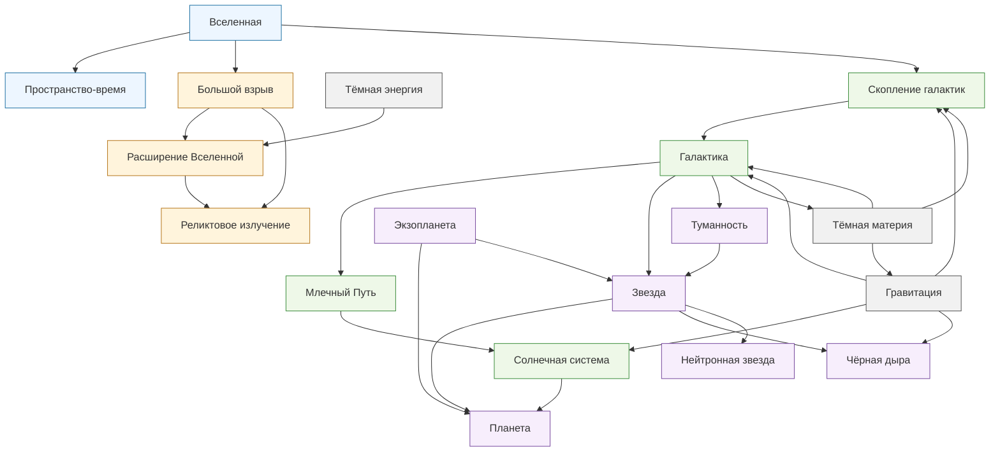

# Как устроена Вселенная

**Раздел:** 1.1 Структура мира  
**Группа:** TODO: название команды

---

## О разделе

В этом подразделе собраны статьи о том, как устроен космос: от Вселенной и Большого взрыва до галактик, звёзд, планет, чёрных дыр, тёмной материи и тёмной энергии.

Материалы написаны простым языком и связаны перекрёстными ссылками, чтобы можно было читать раздел как единую карту: сначала разобраться с общей картиной, затем перейти к объектам внутри галактик и закончить самыми загадочными явлениями современной космологии.

## Карта понятий

## Содержание

| № | Понятие | Краткое описание |
|---|---|---|
| 1 | [Вселенная](articles/01_universe.md) | Всё, что существует: пространство, время, вещество, энергия, галактики, звёзды, планеты и загадочные компоненты космоса. |
| 2 | [Большой взрыв](articles/02_big_bang.md) | Научная модель ранней горячей и плотной Вселенной, из которой объясняют расширение космоса и реликтовое излучение. |
| 3 | [Пространство-время](articles/03_spacetime.md) | Единое описание пространства и времени, важное для понимания гравитации, чёрных дыр и космологии. |
| 4 | [Галактика](articles/04_galaxy.md) | Огромная система из звёзд, газа, пыли и тёмной материи, связанная гравитацией. |
| 5 | [Млечный Путь](articles/05_milky_way.md) | Наша галактика, в которой находятся Солнечная система, Земля и видимые на ночном небе звёзды. |
| 6 | [Звезда](articles/06_star.md) | Горячий шар газа и плазмы, который светит благодаря термоядерным реакциям в недрах. |
| 7 | [Солнечная система](articles/07_solar_system.md) | Солнце, планеты, спутники, астероиды, кометы и малые тела, связанные гравитацией. |
| 8 | [Планета](articles/08_planet.md) | Небесное тело, которое обращается вокруг звезды или звёздного остатка и не светит как звезда. |
| 9 | [Экзопланета](articles/09_exoplanet.md) | Планета за пределами Солнечной системы, обращающаяся вокруг другой звезды или звёздного остатка. |
| 10 | [Туманность](articles/10_nebula.md) | Большое облако газа и пыли, где могут рождаться звёзды или оставаться следы погибших звёзд. |
| 11 | [Чёрная дыра](articles/11_black_hole.md) | Область пространства-времени с такой сильной гравитацией, что после горизонта событий наружу не выходит даже свет. |
| 12 | [Нейтронная звезда](articles/12_neutron_star.md) | Сверхплотный остаток массивной звезды после взрыва сверхновой. |
| 13 | [Гравитация](articles/13_gravity.md) | Притяжение, которое удерживает планеты на орбитах, собирает звёзды и формирует крупные структуры Вселенной. |
| 14 | [Тёмная материя](articles/14_dark_matter.md) | Невидимая форма материи, которую замечают по гравитационному влиянию на галактики и их скопления. |
| 15 | [Тёмная энергия](articles/15_dark_energy.md) | Загадочная форма энергии, с которой связывают ускоренное расширение Вселенной. |
| 16 | [Расширение Вселенной](articles/16_universe_expansion.md) | Увеличение расстояний между далёкими областями космоса и связь этого процесса с красным смещением. |
| 17 | [Реликтовое излучение](articles/17_cosmic_microwave_background.md) | Слабое микроволновое излучение ранней Вселенной, один из главных следов Большого взрыва. |
| 18 | [Скопление галактик](articles/18_galaxy_cluster.md) | Крупная гравитационно связанная система из сотен и тысяч галактик, горячего газа и тёмной материи. |

## Как читать

Начни с [Вселенная](articles/01_universe.md), [Большой взрыв](articles/02_big_bang.md) и [Пространство-время](articles/03_spacetime.md), чтобы увидеть общую картину. Потом переходи к галактикам, звёздам и планетам. Самые сложные темы — [тёмная материя](articles/14_dark_matter.md), [тёмная энергия](articles/15_dark_energy.md), [расширение Вселенной](articles/16_universe_expansion.md) и [реликтовое излучение](articles/17_cosmic_microwave_background.md) — удобнее читать после базовых статей.
