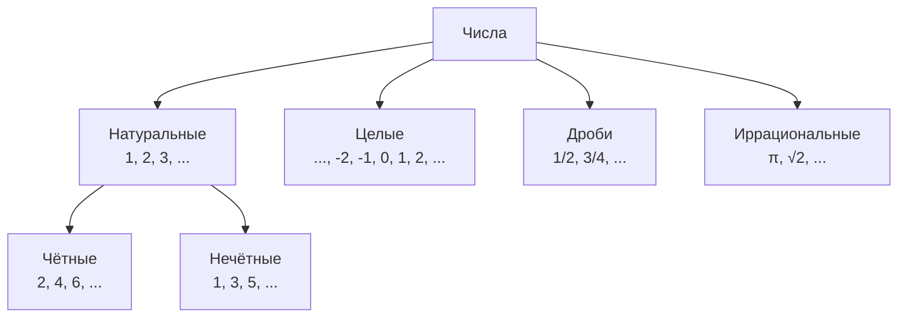

# Числа вокруг нас

Ты встречаешь числа каждый день, даже не замечая этого. Номер квартиры на двери, [время](../../physics_in_everyday_life/Q20702.md) на часах, [цена](../../../6.1_Independent_living_and_daily_living_skills/reasonable_spending/articles/price.md) в магазине, количество сообщений в телефоне — всё это числа. Но что такое число и зачем люди вообще придумали считать?

---

## Что такое число

**Число** — это способ описать количество или [порядок](../../physics_in_everyday_life/Q45003.md) чего-либо. Когда древние люди хотели [запомнить](../../../4.1_rules_of_study/how_to_memorize/articles/zapominanie.md), сколько у них овец, они делали зарубки на кости: одна зарубка — одна овца. Это был первый счёт.

Постепенно люди придумали специальные символы — **цифры**. Сегодня мы используем десять цифр: 0, 1, 2, 3, 4, 5, 6, 7, 8, 9. Из них можно собрать любое число, сколь угодно большое.

---

## [Виды](../../../3.1_healthy_lifestyle/pervaya_pomoshch/ushibi_porezy_ozhogi/08_porezy_sadiny_vidy.md) чисел

- **Натуральные числа** — это обычные числа для счёта: 1, 2, 3... Ими считают предметы.
- **Ноль** — особое число. Оно означает «ничего нет».
- **Отрицательные числа** — числа меньше нуля. Ими описывают температуру ниже нуля или [долг](../../../2.1_society/cause_and_effect_relationships/articles/responsibility.md).
- **[Дроби](02_fractions.md)** — числа между целыми. Половина пиццы — это 1/2.

---

## Числа в твоей жизни

| Где встречается | Пример |
|----------------|--------|
| Время | 07:30 — время подъёма |
| [Адрес](../../../5.1_technology_and_digital_literacy/how_internet_works/articles/ip_mac/ip_and_mac.md) | ул. Ленина, **д. 12, кв. 45** |
| Телефон | +7 **916 123-45-67** |
| [Оценка](../../../4.1_rules_of_study/how_to_learn_effectively/articles/self_reflection.md) | **5** по математике |
| [Скорость](../../physics_in_everyday_life/Q11402.md) | автобус едет **60** км/ч |
| [Музыка](../../neurobiology_for_teens/articles/18_music_chills.md) | [ритм](../../neurobiology_for_teens/articles/18_music_chills.md) **4/4** — четыре удара в такте |

---

## Интересные [факты](../../physics_in_everyday_life/Q17737.md)

- Число **π (пи)** ≈ 3,14159... не заканчивается и не повторяется. Его вычисляют уже несколько тысяч лет.
- Самое большое число с названием — **гугол**: это [единица](06_scale.md) с **сотней** нулей.
- Индейцы майя первыми придумали **ноль** как отдельное число — без него не было бы компьютеров.
- Число **7** считается «счастливым» во многих культурах — совпадение или [математика](../../physics_in_everyday_life/Q140028.md)?

---

## Краткое [резюме](../../../8.2_future/choosing_a_career_path/articles/resume.md)

Числа — универсальный [язык](../../../5.2_cybersecurity/cpp_fundamentals/1_introduction.md), на котором говорит вся [наука](../../physics_in_everyday_life/Q238323.md). Они позволяют описывать количество, порядок, размер и [отношения](../../../2.1_society/how_and_where_find_friends/articles/guide_dlya_introvertov.md) между предметами. Без чисел невозможно было бы построить дом, приготовить еду по рецепту или запустить ракету в [космос](../../../1.1_structure_of_the_world/how_universe_works/articles/01_universe.md).

---

## См. также

- [Дроби и проценты](02_fractions.md)
- [Геометрия вокруг нас](04_geometry.md)
- [Математика в технологиях](15_math_in_tech.md)

---
*[Автор](../../../4.2_thinking_and_working_information/how_to_search_information/articles/copypaste.md): Пинчук Михаил*
*[Ресурсы](../../../2.1_society/cause_and_effect_relationships/articles/ecological_footprint.md): WikiData (Q11563), DeepSeek*
