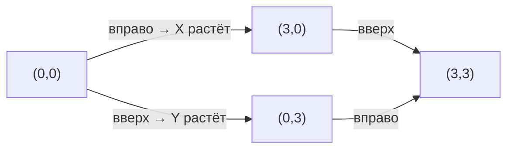

# Координаты и карты

Как описать, где именно ты находишься? Можно сказать «у большого дерева рядом с синей скамейкой» — но это неточно. Математики придумали более надёжный способ: **координаты**. Именно они лежат в основе навигаторов, карт и даже видеоигр.

---

## Что такое координаты

**Координаты** — это два [числа](01_numbers.md), которые точно указывают положение точки в пространстве (или на плоскости).

Представь лист бумаги в клетку. Проведи две линии: горизонтальную ([ось](../../physics_in_everyday_life/Q634.md) **X**) и вертикальную (ось **Y**). Место их пересечения — **начало координат (0, 0)**.

Теперь любую точку можно описать парой чисел **(X, Y)**:
- X показывает, насколько далеко вправо
- Y показывает, насколько далеко вверх

---

## Координаты в жизни

### [Шахматы](../../../../8.1_entertainment/articles/board-games.md) и морской бой
В шахматах клетки обозначают буквой и цифрой: **e4**, **c7**. В игре «морской бой» — тоже координаты: **А3**, **Б5**. Это та же система!

### GPS-навигатор
[Земля](../../../1.1_ustroystvo_mira/zemlya_priroda_i_klimat/articles/earth.md) тоже имеет систему координат — **широту** и **долготу**. [Москва](../../../2.2_society/history/articles/Third_Rome.md) находится примерно на **55° с.ш.** и **37° в.д.** Любой [смартфон](../../physics_in_everyday_life/Q3198.md) с GPS знает свои координаты с точностью до нескольких метров.

### Карты в интернете
Google Maps и [Яндекс](../../../7.1_art/modern_technological_art/articles/5.5_yandex_neural.md).Карты работают именно на основе координат. Когда ты «бросаешь булавку» на карту — ты указываешь координаты точки.

---

## Интересные [факты](../../physics_in_everyday_life/Q17737.md)

- Система координат, которую мы используем, изобрёл **Рене Декарт** в XVII веке — пока болел и лежал в постели, наблюдая за мухой на потолке.
- Пилоты самолётов задают маршрут набором координатных точек — **waypoints**.
- В [Minecraft](../../../5.1_technology_and_digital_literacy/how_internet_works/articles/tcp_udp/online_games.md) весь мир — тоже система координат (X, Y, Z): нажми F3 и увидишь своё положение.

---

## Краткое [резюме](../../../8.2_future/choosing_a_career_path/articles/resume.md)

Координаты — математический способ точно описать расположение любого объекта. Они используются повсюду: от детских игр до спутниковой навигации. Две числа (X и Y) полностью описывают положение точки на плоскости.

---

## См. также

- [Геометрия вокруг нас](04_geometry.md)
- [Масштаб и измерения](06_scale.md)
- [Математика в технологиях](15_math_in_tech.md)

---
*[Автор](../../../4.2_thinking_and_working_information/how_to_search_information/articles/copypaste.md): Пинчук Михаил*
*[Ресурсы](../../../2.1_society/cause_and_effect_relationships/articles/ecological_footprint.md): WikiData (Q43649), [ChatGPT](../../../7.1_art/modern_technological_art/articles/6.1_prompt_art.md)*
