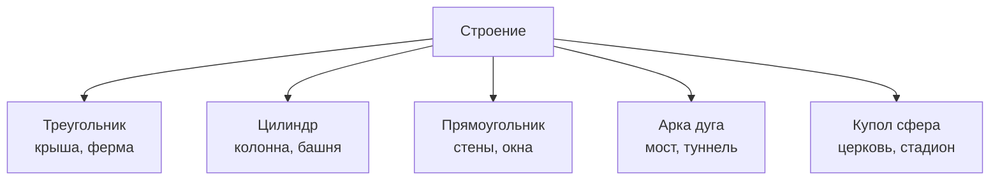

# Геометрия вокруг нас

Почему соты в улье — шестиугольники, а не квадраты? Почему арки мостов — дуги, а не прямые углы? Почему мыльный [пузырь](../../../5.1_technology_and_digital_literacy/information and media literacy/алгоритмы_и_пузырь_фильтров.md) всегда шар? На все эти [вопросы](../../../4.1_rules_of_study/how_to_learn_effectively/articles/curiosity.md) отвечает **геометрия** — [наука](../../physics_in_everyday_life/Q238323.md) о формах и пространстве.

---

## Что изучает геометрия

**Геометрия** (от греч. «гео» — [земля](../../../1.1_ustroystvo_mira/zemlya_priroda_i_klimat/articles/earth.md), «метрия» — [измерение](06_scale.md)) изучает формы, размеры и взаимное расположение фигур.

### Основные фигуры

| Фигура | Свойство | Где встречается |
|--------|---------|----------------|
| Треугольник | Самая жёсткая конструкция | [Мосты](../../physics_in_everyday_life/Q62932.md), крыши, Эйфелева [башня](../../../7.1_art/musical_instruments/articles/carillon.md) |
| Прямоугольник | Удобно укладывать | Комнаты, экраны, [книги](../../../7.2 Media, leisure and hobbies /useful_and_interesting_leisure/articles/reading_and_self_education.md) |
| Круг | Минимальный периметр при максимальной площади | Колёса, [тарелки](../../../7.1_art/musical_instruments/articles/drums.md), [монеты](../../../6.1_Independent_living_and_daily_living_skills/reasonable_spending/articles/cash.md) |
| Шестиугольник | Эффективно заполняет [пространство](../../physics_in_everyday_life/Q36253.md) | Соты, черепаший панцирь |
| Сфера | Минимальная [поверхность](../../physics_in_everyday_life/Q35197.md) при максимальном объёме | Мыльный пузырь, [планеты](../../../1.1_structure_of_the_world/how_universe_works/articles/08_planet.md) |

---

## Почему [природа](13_math_in_nature.md) выбирает геометрию

Пчёлы строят соты из **шестиугольников**, потому что эта форма:
- плотно заполняет пространство без зазоров
- требует меньше всего воска для постройки
- прочная

Мыльный пузырь — всегда **шар**, потому что при одинаковом объёме шар имеет наименьшую [площадь](06_scale.md) поверхности. Природа «экономит».

---

## Геометрия в архитектуре

---

## Площадь и периметр

- **Периметр** — [длина](06_scale.md) контура фигуры ([сумма](../../../6.1_Independent_living_and_daily_living_skills/reasonable_spending/articles/receipt.md) всех сторон)
- **Площадь** — величина поверхности внутри контура

Например, для прямоугольника со сторонами **4 м** и **3 м**:
- Периметр = 4 + 3 + 4 + 3 = **14 м**
- Площадь = 4 × 3 = **12 м²**

Именно площадь нужна, когда ты считаешь, сколько линолеума купить для комнаты.

---

## Интересные [факты](../../physics_in_everyday_life/Q17737.md)

- Египетские пирамиды построены с поразительной точностью: [погрешность](../../physics_in_everyday_life/Q107715.md) углов составляет менее **0,05°**.
- Знаменитый архитектор Гауди строил соборы, изучая формы **подвешенных цепочек** — они сами принимали оптимальную форму.
- Паук плетёт паутину в форме **спирали**, связанной с числами [Фибоначчи](10_sequences.md) — это делает её максимально прочной.

---

## Краткое [резюме](../../../8.2_future/choosing_a_career_path/articles/resume.md)

Геометрия — [язык](../../../5.2_cybersecurity/cpp_fundamentals/1_introduction.md) форм, которые окружают нас повсюду. Треугольники делают конструкции прочными, шары и круги — экономными. Природа тысячелетиями «находила» оптимальные геометрические решения, а математики описали их формулами.

---

## См. также

- [Симметрия](05_symmetry.md)
- [Масштаб и измерения](06_scale.md)
- [Математика в природе](13_math_in_nature.md)

---
*[Автор](../../../4.2_thinking_and_working_information/how_to_search_information/articles/copypaste.md): Пинчук Михаил*
*[Ресурсы](../../../2.1_society/cause_and_effect_relationships/articles/ecological_footprint.md): WikiData (Q8087), DeepSeek*
