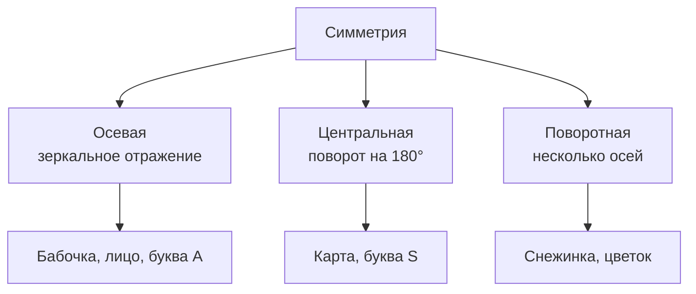

# Симметрия

Почему мы считаем красивыми бабочек, [снежинки](../../../1.1_ustroystvo_mira/zemlya_priroda_i_klimat/articles/precipitation.md) и соборы? Один из секретов красоты — **симметрия**. [Математика](../../physics_in_everyday_life/Q140028.md) объясняет, почему симметричные вещи так притягивают взгляд.

---

## Что такое симметрия

**Симметрия** — это когда одна часть объекта является зеркальным отражением другой (или совпадает с ней при повороте, переносе).

Если сложить бабочку пополам — левое крыло в точности совпадёт с правым. Это **осевая симметрия**: есть [ось](../../physics_in_everyday_life/Q634.md), которая делит фигуру на две одинаковые половины.

---

## [Виды](../../../3.1_healthy_lifestyle/pervaya_pomoshch/ushibi_porezy_ozhogi/08_porezy_sadiny_vidy.md) симметрии

### 1. Осевая (зеркальная)
[Фигура](04_geometry.md) делится на два зеркальных отражения.

**Примеры:** лицо человека, лист дерева, сердечко ♥, буква **А**.

### 2. Центральная
Фигура совпадает сама с собой при повороте на 180° вокруг центральной точки.

**Примеры:** буква **S**, игральная [карта](03_coordinates.md), знак ♾️.

### 3. Поворотная (радиальная)
Фигура совпадает с собой при повороте на определённый угол.

**Примеры:** снежинка (6 осей симметрии), ромашка, морская [звезда](../../../1.1_structure_of_the_world/how_universe_works/articles/06_star.md).

---

## Симметрия в природе и жизни

- **[Тело](../../why_science_help_understand_world/organism.md) человека** — симметрично: два [глаза](../../../7.2 Media, leisure and hobbies/Computer games/articles/useful_tips/eyes_and_back.md), два уха, две руки. Это помогает двигаться и держать [равновесие](../../../1.1_ustroystvo_mira/zemlya_priroda_i_klimat/articles/ecosystem.md).
- **Снежинки** всегда имеют 6 лучей — из-за молекулярной структуры льда.
- **Архитектура**: большинство храмов и дворцов симметричны — это создаёт ощущение гармонии.
- **Логотипы**: Apple, BMW, Mercedes — все симметричные знаки. Их легче [запомнить](../../../4.1_rules_of_study/how_to_memorize/articles/zapominanie.md).

---

## Асимметрия тоже важна

[Природа](13_math_in_nature.md) нарушает симметрию намеренно. У нас:
- [Сердце](../../../3.1. healthy lifestyle/Sleep, nutrition, and adolescent energy/articles/the_energy_trap.md) — слева
- Печень — справа
- У улитки [спираль](13_math_in_nature.md) закручена в одну сторону

Асимметрия делает вещи живыми и интересными.

---

## Интересные [факты](../../physics_in_everyday_life/Q17737.md)

- Исследования показывают, что люди считают более **симметричные лица** более красивыми — это биологический инстинкт.
- [Кристаллы](../../physics_in_everyday_life/Q11469.md) всегда растут по законам симметрии — поэтому все кубики соли идеально квадратные.
- Математический раздел, изучающий симметрию, называется **[теория](../../why_science_help_understand_world/science.md) групп** — одна из самых важных областей современной математики.

---

## Краткое [резюме](../../../8.2_future/choosing_a_career_path/articles/resume.md)

Симметрия — математическое выражение гармонии. Она встречается в природе, искусстве и архитектуре. Существуют разные виды симметрии: зеркальная, центральная, поворотная. Симметрия связана с красотой, прочностью и экономичностью форм.

---

## См. также

- [Геометрия вокруг нас](04_geometry.md)
- [Математика в природе](13_math_in_nature.md)
- [Золотое сечение](14_golden_ratio.md)

---
*[Автор](../../../4.2_thinking_and_working_information/how_to_search_information/articles/copypaste.md): Пинчук Михаил*
*[Ресурсы](../../../2.1_society/cause_and_effect_relationships/articles/ecological_footprint.md): WikiData (Q41538), GigaChat*
