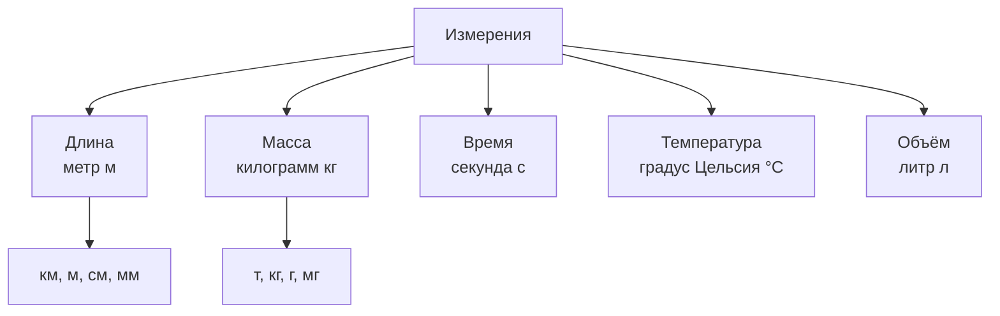

# Масштаб и измерения

Как уместить всю Россию на лист бумаги? Как архитектор рисует дом, который потом построят в натуральную величину? [Ответ](../../../5.1_technology_and_digital_literacy/how_internet_works/articles/http_https/http_https.md) — **масштаб**. А чтобы всё это работало, нужны единые [единицы измерения](../../physics_in_everyday_life/Q170282.md).

---

## Что такое масштаб

**Масштаб** — это отношение размера на чертеже (карте) к реальному размеру объекта.

Например, масштаб **1:100 000** означает: **1 сантиметр** на карте = **100 000 сантиметров** (= **1 километр**) в реальности.

### [Виды](../../../3.1_healthy_lifestyle/pervaya_pomoshch/ushibi_porezy_ozhogi/08_porezy_sadiny_vidy.md) масштаба

| Вид | Пример | Применение |
|-----|--------|-----------|
| Уменьшающий | 1:1 000 000 | [Карта](03_coordinates.md) страны |
| Увеличивающий | 10:1 | Схема [микросхемы](../../physics_in_everyday_life/Q5339.md) |
| Натуральный | 1:1 | Паспорт |

---

## Единицы измерения

Чтобы разные люди понимали друг друга, в мире договорились об **единых единицах** — Международной системе единиц ([СИ](../../physics_in_everyday_life/Q12453.md)).

---

## Масштаб в жизни

### [Карты](03_coordinates.md)
Туристическая карта города: масштаб **1:25 000**.
10 см на карте = 25 000 × 10 = **250 000 см = 2,5 км** в реальности.

### Архитектурный чертёж
Архитектор рисует комнату 6 × 4 метра в масштабе 1:50.
На бумаге: 6 м ÷ 50 = **12 см** × 4 м ÷ 50 = **8 см**.

### [Модели](../../physics_in_everyday_life/Q172280.md)
Масштабная модель самолёта 1:72 — если настоящий самолёт 36 метров, модель будет **50 см**.

---

## Интересные [факты](../../physics_in_everyday_life/Q17737.md)

- Слово **«[метр](../../physics_in_everyday_life/Q36253.md)»** происходит от греческого «metron» — мера. Его ввели в 1791 году во Франции.
- Американцы до сих пор используют **дюймы, фунты и мили** вместо метров и килограммов — это иногда вызывает казусы: в 1999 году зонд Mars Climate Orbiter разбился из-за путаницы в единицах измерения!
- [Световой год](../../physics_in_everyday_life/Q1.md) — это **единица длины** (не времени!): [расстояние](../../physics_in_everyday_life/Q11412.md), которое [свет](../../physics_in_everyday_life/Q1.md) проходит за год ≈ 9,5 трлн км.

---

## Краткое [резюме](../../../8.2_future/choosing_a_career_path/articles/resume.md)

Масштаб позволяет изображать большие или маленькие объекты в удобном размере. Единицы измерения — общий [язык](../../../5.2_cybersecurity/cpp_fundamentals/1_introduction.md), без которого строители, учёные и навигаторы не смогли бы понять друг друга. Правильный масштаб и единицы — залог точности в науке и технике.

---

## См. также

- [Координаты и карты](03_coordinates.md)
- [Геометрия вокруг нас](04_geometry.md)
- [Математика в технологиях](15_math_in_tech.md)

---
*[Автор](../../../4.2_thinking_and_working_information/how_to_search_information/articles/copypaste.md): Никольский Константин*
*[Ресурсы](../../../2.1_society/cause_and_effect_relationships/articles/ecological_footprint.md): WikiData (Q194356), [ChatGPT](../../../7.1_art/modern_technological_art/articles/6.1_prompt_art.md)*
