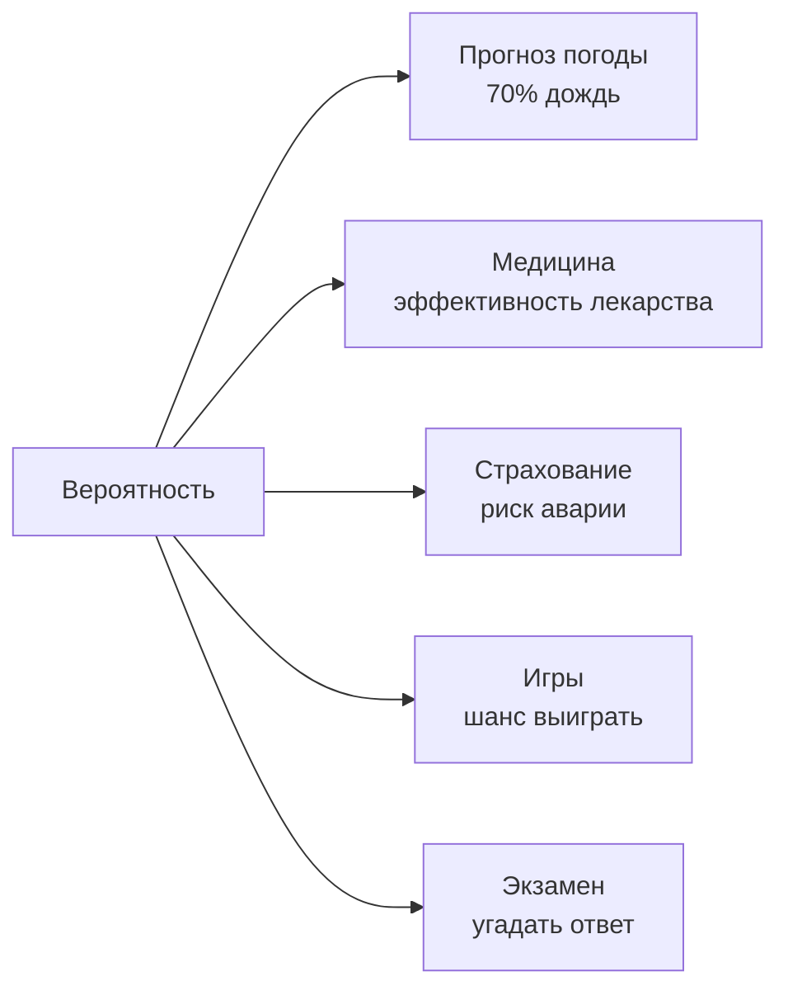

# Вероятность

Какой шанс, что завтра будет [дождь](../../../1.1_ustroystvo_mira/zemlya_priroda_i_klimat/articles/clouds.md)? Что выпадет «орёл» при броске [монеты](../../../6.1_Independent_living_and_daily_living_skills/reasonable_spending/articles/cash.md)? Что ты угадаешь правильный [ответ](../../../5.1_technology_and_digital_literacy/how_internet_works/articles/http_https/http_https.md) наугад в тесте из 4 вариантов? Всем этим занимается **[теория](../../why_science_help_understand_world/science.md) вероятностей** — [математика](../../physics_in_everyday_life/Q140028.md) случайности.

---

## Что такое вероятность

**Вероятность** — это [число](01_numbers.md) от 0 до 1, которое показывает, насколько возможно какое-то [событие](../../../2.1_society/cause_and_effect_relationships/articles/causality_base.md).

- **0** — событие невозможно (выпадет «7» на кубике с гранями 1–6)
- **1** — событие обязательно произойдёт ([солнце](../../../1.1_ustroystvo_mira/zemlya_priroda_i_klimat/articles/climate.md) взойдёт завтра)
- **0,5** — событие возможно с равным шансом (орёл или решка)

Вероятность часто выражают в процентах: 0,5 = **50%**, 0,25 = **25%**.

---

## Как считать вероятность

$$P = \frac{\text{число благоприятных исходов}}{\text{общее число возможных исходов}}$$

### Пример: кубик

Бросаем обычный кубик (грани 1–6).

- Вероятность выпадения **6**: P = 1/6 ≈ **17%**
- Вероятность выпадения **чётного** (2, 4, 6): P = 3/6 = **50%**
- Вероятность выпадения **больше 4** (5 или 6): P = 2/6 ≈ **33%**

---

## Вероятность в жизни

### [Прогноз погоды](../../../1.1_ustroystvo_mira/zemlya_priroda_i_klimat/articles/weather.md)
Когда метеорологи говорят «70% вероятность дождя» — это значит: из 100 похожих дней в 70 шёл дождь.

### Тест на угадывание
В тесте 4 варианта ответа. Если угадываешь: P = 1/4 = **25%**. Из 20 вопросов угадаешь примерно **5**.

---

## Интересные [факты](../../physics_in_everyday_life/Q17737.md)

- Вероятность попасть молнией в одного человека за [жизнь](../../../1.1_ustroystvo_mira/zemlya_priroda_i_klimat/articles/biosphere.md) — около **1:15 000** (≈ 0,007%).
- Лотерея «6 из 45»: вероятность главного выигрыша — **1 из 8 145 060**.
- Знаменитый **«парадокс дней рождения»**: в группе всего из 23 [человек](../../physics_in_everyday_life/Q45003.md) вероятность, что двое празднуют день рождения в один день — **более 50%**!

---

## Краткое [резюме](../../../8.2_future/choosing_a_career_path/articles/resume.md)

Вероятность — математический способ описать случайность. Она измеряется от 0 до 1 и вычисляется как отношение благоприятных исходов к общему числу возможных. Теория вероятностей помогает принимать решения в условиях неопределённости — от прогноза погоды до медицины.

---

## См. также

- [Статистика](08_statistics.md)
- [Числа вокруг нас](01_numbers.md)
- [Логика и рассуждения](11_logic.md)

---
*[Автор](../../../4.2_thinking_and_working_information/how_to_search_information/articles/copypaste.md): Никольский Константин*
*[Ресурсы](../../../2.1_society/cause_and_effect_relationships/articles/ecological_footprint.md): WikiData (Q9492), DeepSeek*
