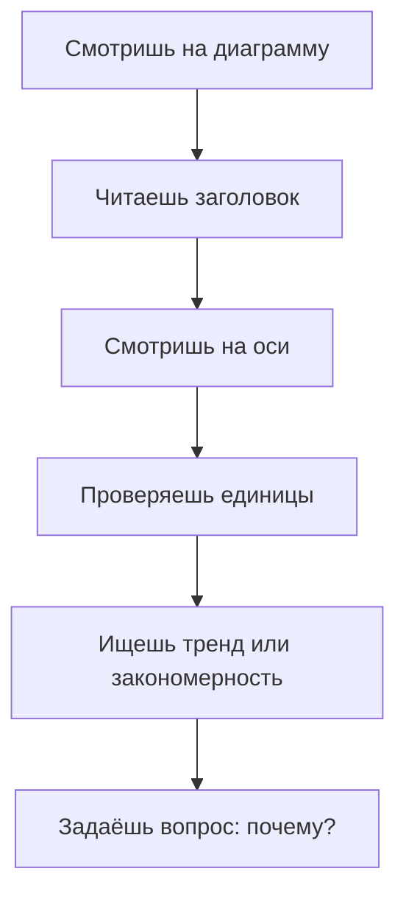

# Графики и диаграммы

Одна хорошая картинка стоит тысячи цифр. Именно поэтому учёные, журналисты и программисты превращают [числа](01_numbers.md) в **графики и диаграммы** — чтобы увидеть то, что скрыто в таблицах.


---

## Зачем нужны графики

Представь таблицу: [температура](../../../1.1_ustroystvo_mira/zemlya_priroda_i_klimat/articles/climate.md) каждый день за год — 365 чисел. Трудно понять, когда было жарко, а когда холодно. Но если нарисовать **линейный график** — сразу видны лето и [зима](../../../3.2 healthy lifestyle/how to act in a dangerous situation/articles/thin-ice.md), тёплые и холодные годы.

---

## Основные [виды](../../../3.1_healthy_lifestyle/pervaya_pomoshch/ushibi_porezy_ozhogi/08_porezy_sadiny_vidy.md) диаграмм

### Линейный график
Показывает изменение во времени.

**Когда использовать:** температура, [рост](../../../3.1. healthy lifestyle/Sleep, nutrition, and adolescent energy/articles/micronutrients_and_teenagers.md), курс валюты.

```
Температура (°C)
25 |        *  *
20 |      *       *
15 |    *            *
10 | *                  *
   |________________________
     Янв Фев Мар Апр Май Июн
```

### Столбчатая диаграмма
Сравнивает несколько категорий.

**Когда использовать:** [оценки](../../../3.1. healthy lifestyle/Sleep, nutrition, and adolescent energy/articles/sleep_and_memory_grades.md) по предметам, продажи, голоса.

### Круговая диаграмма
Показывает доли целого.

**Когда использовать:** [бюджет](../../../6.1_Independent_living_and_daily_living_skills/reasonable_spending/articles/budget.md), [состав](../../physics_in_everyday_life/Q11469.md) чего-либо, распределение времени.

### Точечная диаграмма (scatter plot)
Ищет [связь](../../physics_in_everyday_life/Q12969754.md) между двумя величинами.

**Когда использовать:** рост и [вес](../../physics_in_everyday_life/Q11023.md), [возраст](../../../5.1_technology_and_digital_literacy/information and media literacy/карта_компетенций_по_возрастам.md) и [зарплата](../../../8.2_future/choosing_a_career_path/articles/salary.md).

---

## Как читать диаграммы



> **Важно:** [масштаб](06_scale.md) осей может обмануть! Если [ось](../../physics_in_everyday_life/Q634.md) Y начинается не с 0, разница кажется больше, чем она есть.

---

## Интересные [факты](../../physics_in_everyday_life/Q17737.md)

- Первый известный график данных нарисовал **Уильям Плейфэр** в 1786 году — он придумал столбчатые и круговые диаграммы.
- **Инфографика** — это когда диаграммы объединяют с рисунками и текстом. Её [мозг](../../../3.1. healthy lifestyle/Sleep, nutrition, and adolescent energy/articles/breakfast_for_the_brain.md) воспринимает **60 000 раз быстрее**, чем [текст](../../../4.1_rules_of_study/how_to_learn_effectively/articles/reading_skills.md).
- У Excel более **70 видов** диаграмм — для любой [задачи](../../why_science_help_understand_world/research_work.md) найдётся свой [тип](../../../5.2_cybersecurity/cpp_fundamentals/13_struct.md).

---

## Краткое [резюме](../../../8.2_future/choosing_a_career_path/articles/resume.md)

Графики и диаграммы — [визуальный язык](../../../7.2 Media, leisure and hobbies /what_you_can_read_and_watch_to_develop_your_taste/articles/z2.md) математики. Они помогают быстро увидеть тренды, сравнить [данные](08_statistics.md) и найти связи. Важно уметь не только читать, но и критически проверять диаграммы — их можно использовать для манипуляции.

---

## См. также

- [Статистика](08_statistics.md)
- [Вероятность](07_probability.md)
- [Математика в технологиях](15_math_in_tech.md)

---
*[Автор](../../../4.2_thinking_and_working_information/how_to_search_information/articles/copypaste.md): Никольский Константин*
*[Ресурсы](../../../2.1_society/cause_and_effect_relationships/articles/ecological_footprint.md): WikiData (Q742794), [ChatGPT](../../../7.1_art/modern_technological_art/articles/6.1_prompt_art.md)*
