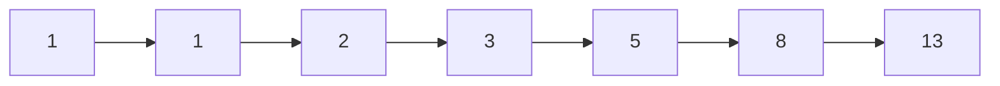

# Последовательности и закономерности

1, 1, 2, 3, 5, 8, 13, 21... Замечаешь закономерность? Каждое следующее [число](01_numbers.md) — [сумма](../../../6.1_Independent_living_and_daily_living_skills/reasonable_spending/articles/receipt.md) двух предыдущих. Это знаменитая **последовательность Фибоначчи** — и она встречается в цветах, раковинах улиток и даже в финансах.

---

## Что такое последовательность

**Последовательность** — это [числа](01_numbers.md), выстроенные в определённом порядке по какому-то правилу.

- **2, 4, 6, 8, 10...** — чётные числа (каждый раз +2)
- **1, 3, 9, 27, 81...** — [степени](../../../3.1_healthy_lifestyle/pervaya_pomoshch/ushibi_porezy_ozhogi/13_ozhogi_vidy_stepeni.md) тройки (каждый раз ×3)
- **100, 50, 25, 12,5...** — каждый раз делится пополам

---

## Арифметическая прогрессия

Каждый следующий член отличается от предыдущего на **одно и то же число** (разность).

> **5, 8, 11, 14, 17...** → разность = 3

Примеры из жизни:
- Этажи лифта: 1, 2, 3, 4...
- [Копилка](../../../6.1_Independent_living_and_daily_living_skills/reasonable_spending/articles/savings.md): кладёшь каждый день по 10 рублей: 10, 20, 30, 40...

## Геометрическая прогрессия

Каждый следующий член умножается на **одно и то же число** (знаменатель).

> **1, 2, 4, 8, 16, 32...** → знаменатель = 2

Примеры из жизни:
- [Вирус](../../../5.2_cybersecurity/passwords_cyber_safety/articles/virus.md): один заразил 2, те — ещё 4, те — ещё 8...
- Банковский [вклад](../../../6.2_money_and_literacy/how_to_save_for_goal/articles/bank_account.md) с процентами: [деньги](../../../2.1_society/cause_and_effect_relationships/articles/economic_chains.md) растут в геометрической прогрессии.

---

## Последовательность Фибоначчи

**1, 1, 2, 3, 5, 8, 13, 21, 34, 55...**

[Правило](../../why_science_help_understand_world/patterns.md): каждый член = сумма двух предыдущих.

### Числа Фибоначчи в природе

- Количество лепестков большинства цветов — **числа Фибоначчи**: 3, 5, 8, 13...
- Семена подсолнуха растут по спиралям Фибоначчи
- [Спираль](13_math_in_nature.md) раковины улитки — логарифмическая спираль, связанная с этой последовательностью

---

## Интересные [факты](../../physics_in_everyday_life/Q17737.md)

- Отношение соседних чисел Фибоначчи стремится к **золотому сечению** ≈ 1,618.
- Самая длинная арифметическая прогрессия из простых чисел, найденная людьми, содержит **26 чисел**.
- В музыке ритмические паттерны — тоже последовательности. Четверть, восьмая, шестнадцатая — геометрическая прогрессия.

---

## Краткое [резюме](../../../8.2_future/choosing_a_career_path/articles/resume.md)

Последовательности — числа, связанные закономерностью. Арифметические прогрессии описывают равномерный [рост](../../../3.1. healthy lifestyle/Sleep, nutrition, and adolescent energy/articles/micronutrients_and_teenagers.md), геометрические — ускоренный. Последовательность Фибоначчи пронизывает живую природу и связана с золотым сечением.

---

## См. также

- [Золотое сечение](14_golden_ratio.md)
- [Математика в природе](13_math_in_nature.md)
- [Числа вокруг нас](01_numbers.md)

---
*[Автор](../../../4.2_thinking_and_working_information/how_to_search_information/articles/copypaste.md): Никольский Константин*
*[Ресурсы](../../../2.1_society/cause_and_effect_relationships/articles/ecological_footprint.md): WikiData (Q133900), DeepSeek*
