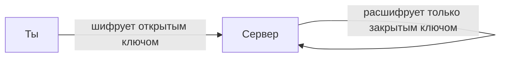

# Шифрование и коды

Когда ты отправляешь [сообщение](../../../3.2 healthy lifestyle/how to act in a dangerous situation/articles/phishing-links.md) другу, как оно остаётся секретным? Когда сканируешь QR-код, как телефон знает, куда перейти? Всё это — **[математика](../../physics_in_everyday_life/Q140028.md) шифрования и кодирования**.


---

## Что такое шифр

**Шифр** — это способ превратить понятный [текст](../../../4.1_rules_of_study/how_to_learn_effectively/articles/reading_skills.md) в непонятный набор символов так, чтобы только тот, кто знает «[ключ](../../../5.1_technology_and_digital_literacy/how_internet_works/articles/http_https/tls.md)», мог его прочитать.

---

## Простые шифры

### Шифр Цезаря
Юлий Цезарь шифровал письма, сдвигая каждую букву на 3 [позиции](../../../7.1_art/musical_instruments/articles/trombone.md) вперёд:

```
А → Г    Б → Д    В → Е
Д → Ж    О → Р    М → П
```

> «МАМ» → «ПГП»

Ключ = **3** ([сдвиг](../../physics_in_everyday_life/Q193514.md)). Чтобы расшифровать — сдвинь обратно.

### Шифр «Переворот»
Пиши слова задом наперёд:
> «ПРИВЕТ» → «ТЕВИРП»

---

## Коды: другая задача

**Код** — это условное [обозначение](../../physics_in_everyday_life/Q30006.md) для удобства, не обязательно для секретности.

### Азбука Морзе
Буквы заменяются точками и тире:
- А = · —
- С = · · ·
- О = — — —

«SOS» = · · · — — — · · ·

### Штрих-код
Полоски разной ширины кодируют [числа](01_numbers.md). Сканер читает, насколько широки светлые и тёмные полосы.

### QR-код
Двумерный штрих-код — хранит до **3 000 символов** в виде квадратной картинки из чёрных и белых квадратиков.

---

## Современное шифрование

Сейчас сайты защищают [данные](08_statistics.md) с помощью **математики больших простых чисел**. [Браузер](../../../5.1_technology_and_digital_literacy/how_internet_works/articles/http_https/http_https.md) и [сервер](../../../5.1_technology_and_digital_literacy/how_internet_works/articles/http_https/http_https.md) обмениваются «замками» (публичными ключами), не передавая секретный ключ. Взломать такой шифр — всё равно что разложить огромное [число](01_numbers.md) (например, 300-значное) на простые множители.



---

## Интересные [факты](../../physics_in_everyday_life/Q17737.md)

- Во Второй мировой войне немецкий шифр **«Энигма»** считался невзламываемым — пока математик **Алан Тьюринг** не создал машину для его взлома.
- Шифрование [HTTPS](../../../5.1_technology_and_digital_literacy/how_internet_works/articles/http_https/http_https.md) защищает **более 90%** всего интернет-трафика в мире.
- Биткоин существует благодаря криптографии — математике шифрования.

---

## Краткое [резюме](../../../8.2_future/choosing_a_career_path/articles/resume.md)

Шифрование превращает информацию в нечитаемый вид с помощью математических преобразований. Коды — [условные обозначения](../../physics_in_everyday_life/Q11656.md) для передачи информации. Современная криптография защищает банковские операции, переписку и целые государства.

---

## См. также

- [Логика и рассуждения](11_logic.md)
- [Математика в технологиях](15_math_in_tech.md)
- [Числа вокруг нас](01_numbers.md)

---
*[Автор](../../../4.2_thinking_and_working_information/how_to_search_information/articles/copypaste.md): Смирнов Андрей*
*[Ресурсы](../../../2.1_society/cause_and_effect_relationships/articles/ecological_footprint.md): WikiData (Q8087), [ChatGPT](../../../7.1_art/modern_technological_art/articles/6.1_prompt_art.md)*
