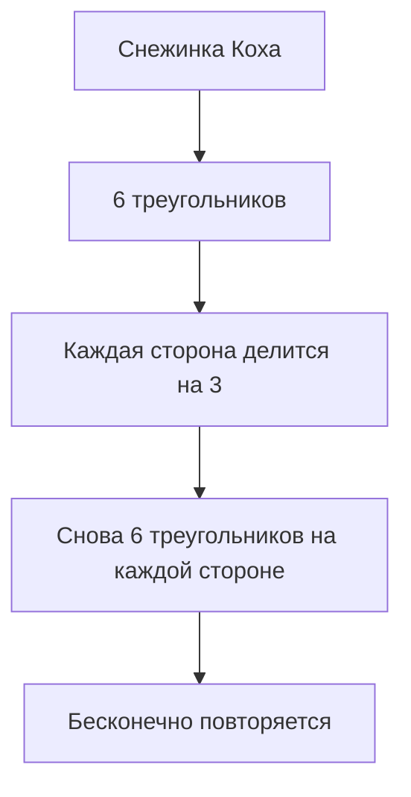

# [Математика](../../physics_in_everyday_life/Q140028.md) в природе

Природа — лучший математик. Она тысячи лет «решала [задачи](../../why_science_help_understand_world/research_work.md)»: как упаковать семена максимально плотно, как вырасти с минимальными затратами энергии, как построить максимально прочную конструкцию. Решения — поразительно красивы и математически точны.

---

## [Числа](01_numbers.md) [Фибоначчи](10_sequences.md) в растениях

Подсолнух — живая математическая [загадка](../../neurobiology_for_teens/articles/19_curiosity.md). Его семена расположены по **двум семействам спиралей**: одни закручены по часовой стрелке, другие — против. Количество спиралей в каждом семействе — **соседние числа Фибоначчи**: 34 и 55, или 55 и 89.

Количество лепестков большинства цветов — тоже числа Фибоначчи:
- Лилия — **3** лепестка
- Лютик — **5** лепестков
- Дельфиниум — **8** лепестков
- Кукуруза — **13** рядов зёрен

---

## Фракталы

**Фрактал** — это [объект](../../physics_in_everyday_life/Q634.md), который выглядит одинаково при любом увеличении. «[Дерево](../../physics_in_everyday_life/Q487005.md)» из дерева: ветка похожа на маленькое дерево, ответвление ветки — ещё меньше.

**Примеры фракталов в природе:**
- [Снежинки](../../../1.1_ustroystvo_mira/zemlya_priroda_i_klimat/articles/precipitation.md)
- Папоротники
- Береговая линия океана
- Кровеносные сосуды
- [Молния](../../../1.1_structure_of_the_world/matter/articles/08_plasma.md)

---

## Золотое сечение в живом мире

Раковина улитки **наутилус** растёт по логарифмической спирали — той самой, которая связана с золотым сечением. Каждый новый виток в **1,618 раз** больше предыдущего.

Похожие спирали:
- Ураганы и циклоны (вид сверху)
- Рог горного барана
- Расположение семян в подсолнухе

---

## Почему природа математична

Природа «выбирает» оптимальные решения через эволюцию:
- Шестиугольные соты пчёл — **максимальная [площадь](06_scale.md)** при **минимуме воска**
- Расположение листьев по спирали — каждый лист получает **[максимум](../../physics_in_everyday_life/Q136980.md) света**
- Мыльный [пузырь](../../../5.1_technology_and_digital_literacy/information and media literacy/алгоритмы_и_пузырь_фильтров.md) — шар, потому что **минимальная [поверхность](../../physics_in_everyday_life/Q35197.md)** при данном объёме

---

## Интересные [факты](../../physics_in_everyday_life/Q17737.md)

- [Число](01_numbers.md) **π (пи)** встречается не только в кругах — оно появляется в формулах для описания радуги, волн и даже [ДНК](../../../7.1_art/modern_technological_art/articles/4.4_bio_art.md).
- Морская [звезда](../../../1.1_structure_of_the_world/how_universe_works/articles/06_star.md) обладает **пятилучевой симметрией** — это геометрически стабильная [форма](04_geometry.md).
- Математик **Бенуа Мандельброт** в 1975 году придумал слово «фрактал» и показал, что природа полна фракталов.

---

## Краткое [резюме](../../../8.2_future/choosing_a_career_path/articles/resume.md)

Природа повсеместно использует математические закономерности: числа Фибоначчи в растениях, фракталы в снежинках и папоротниках, золотое сечение в раковинах. Это не [случайность](07_probability.md) — математические формы обеспечивают оптимальность и прочность.

---

## См. также

- [Золотое сечение](14_golden_ratio.md)
- [Последовательности и закономерности](10_sequences.md)
- [Симметрия](05_symmetry.md)

---
*[Автор](../../../4.2_thinking_and_working_information/how_to_search_information/articles/copypaste.md): Смирнов Андрей*
*[Ресурсы](../../../2.1_society/cause_and_effect_relationships/articles/ecological_footprint.md): WikiData (Q40026), DeepSeek*
