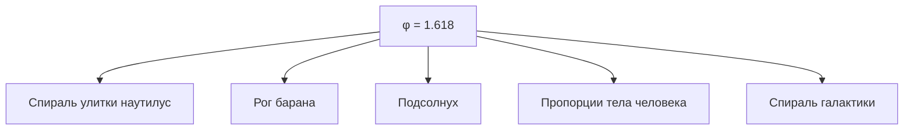

# [Золотое сечение](13_math_in_nature.md)

Есть одно [число](01_numbers.md), которое называют «числом красоты». Оно равно примерно **1,618**. Его обозначают греческой буквой **φ (фи)**. Это **золотое сечение** — одна из самых удивительных математических констант.


---

## Что такое золотое сечение

Золотое сечение — это такое деление отрезка на две части, при котором отношение большей части к меньшей равно отношению всего отрезка к большей части.

```
|——————A——————|———B———|
        (A+B)/A = A/B = φ ≈ 1,618
```

Другими словами: **φ = (1 + √5) / 2 ≈ 1,618033...**

---

## Золотое сечение и [Фибоначчи](10_sequences.md)

Вот удивительная [связь](../../physics_in_everyday_life/Q12969754.md): если взять два соседних **[числа](01_numbers.md) Фибоначчи** и поделить большее на меньшее — получится число, близкое к φ:

| Числа Фибоначчи | Отношение |
|----------------|-----------|
| 5 / 3 | 1,666... |
| 8 / 5 | 1,600 |
| 13 / 8 | 1,625 |
| 89 / 55 | 1,6181... |
| 144 / 89 | 1,61797... |

Чем дальше по ряду — тем точнее. Это поразительно!

---

## Золотое сечение в искусстве и архитектуре

### Парфенон
Греческий храм в Афинах (V в. до н.э.): отношение высоты к ширине фасада ≈ **1 : 1,618**.

### Леонардо да Винчи
«Витрувианский [человек](../../physics_in_everyday_life/Q45003.md)» и «Мона Лиза» построены на пропорциях золотого сечения.

### Современный [дизайн](../../../7.2 Media, leisure and hobbies/Computer games/articles/dream_team/artist.md)
Логотип Apple, [формат](../../../7.2 Media, leisure and hobbies/Computer games/articles/how_it_all_started/cartridge_versus_disc.md) кредитной [карты](03_coordinates.md), соотношение сторон монитора — всё близко к золотому сечению.

---

## Золотое сечение в природе



---

## Почему именно 1,618

Математики доказали, что φ — наиболее «иррациональное» из всех иррациональных чисел. Это делает его идеальным для природных спиралей: при таком угле роста листья и семена **никогда не совпадают** и **всегда получают [максимум](../../physics_in_everyday_life/Q136980.md) солнца и пространства**.

---

## Интересные [факты](../../physics_in_everyday_life/Q17737.md)

- Золотое сечение впервые описал **Евклид** около 300 г. до н.э. в книге «Начала».
- φ² = φ + 1 ≈ 2,618. А 1/φ = φ − 1 ≈ 0,618. Удивительная рекурсия!
- Некоторые учёные полагают, что [восприятие](../../neurobiology_for_teens/articles/26_optical_illusions.md) «красоты лица» связано с близостью его пропорций к золотому сечению.

---

## Краткое [резюме](../../../8.2_future/choosing_a_career_path/articles/resume.md)

Золотое сечение φ ≈ 1,618 — число, связывающее математику, природу и красоту. Оно появляется в последовательности Фибоначчи, спиралях природы, шедеврах архитектуры и искусства. Это одна из самых глубоких констант математики.

---

## См. также

- [Последовательности и закономерности](10_sequences.md)
- [Математика в природе](13_math_in_nature.md)
- [Симметрия](05_symmetry.md)

---
*[Автор](../../../4.2_thinking_and_working_information/how_to_search_information/articles/copypaste.md): Смирнов Андрей*
*[Ресурсы](../../../2.1_society/cause_and_effect_relationships/articles/ecological_footprint.md): WikiData (Q41690), GigaChat*
