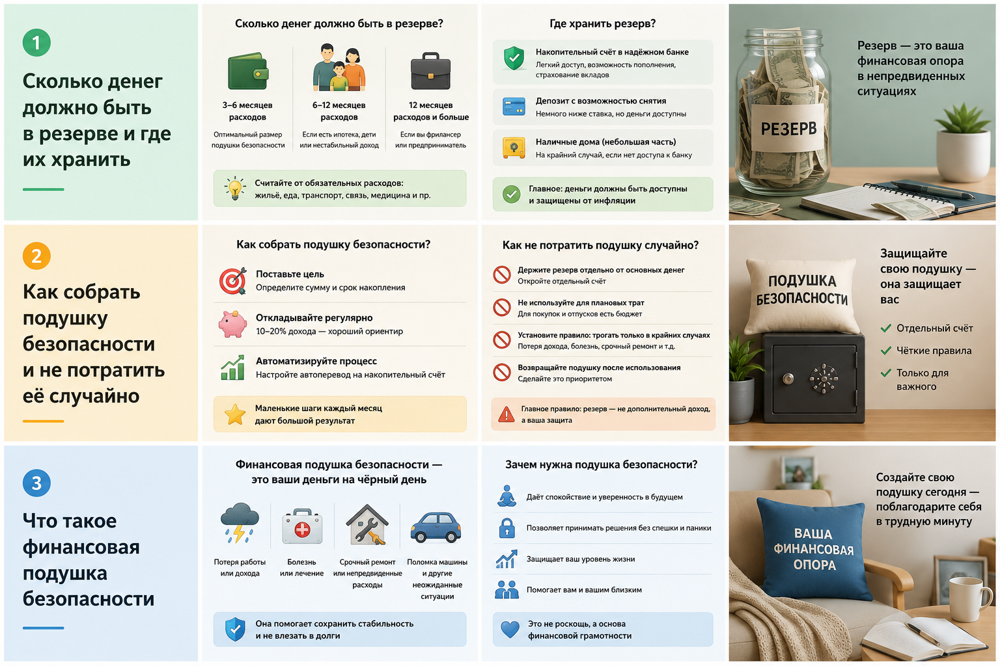
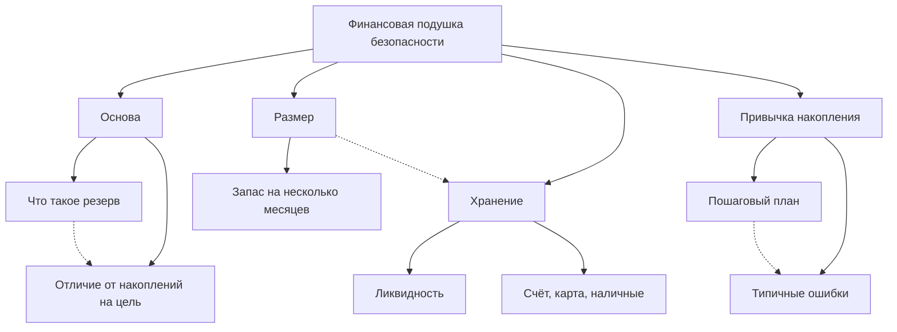

# Финансовая подушка безопасности

**Раздел:** 6.2. Деньги и финансовая грамотность → Финансовая подушка безопасности  
**Команда:** 6666  
**Дата обновления:** 2026-05-21

---

## 📖 Описание направления

Раздел детской энциклопедии, посвящённый финансовой подушке безопасности. Основная идея — простым языком объяснить подростку, зачем нужен резервный фонд, чем он отличается от денег на мечту, как выбрать безопасное место для хранения денег и как выработать привычку регулярно откладывать.

## 🧠 Онтология предметной области

## 🔗 Граф связей между статьями

## 📋 Таблица понятий

| # | Понятие | WikiData | Категория | Автор |
|---|---------|----------|-----------|-------|
| 1 | Что такое финансовая подушка безопасности | [Q1127086](https://www.wikidata.org/wiki/Q1127086) | Основа | Кутугин Даниил |
| 2 | Сколько денег должно быть в резерве и где их хранить | [Q1127086](https://www.wikidata.org/wiki/Q1127086) | Хранение и размер | Кутугин Даниил |
| 3 | Как собрать подушку безопасности и не потратить её случайно | [Q1127086](https://www.wikidata.org/wiki/Q1127086) | Привычка накопления | Кутугин Даниил |

## ⚖️ Сравнение: подушка, накопления, инвестиции

| Инструмент | Главная цель | Риск | Доступность денег | Пример |
|---|---|---|---|---|
| **Финансовая подушка безопасности** | Защитить от неожиданных расходов | Низкий | Высокая | Деньги на счёте или отдельной карте |
| **Накопления на цель** | Купить что-то запланированное | Низкий | Средняя | Копить на ноутбук или поездку |
| **Инвестиции** | Увеличить капитал со временем | Средний или высокий | Не всегда быстрая | Акции, облигации, фонды |

## ✅ Практический чек-лист: как начать сегодня

1. Посчитать обязательные расходы за месяц.
2. Понять, какую первую сумму реально собрать.
3. Выбрать отдельное место хранения для резерва.
4. Отложить первую часть денег сразу после получения.
5. Не трогать резерв без настоящей причины.
6. После использования обязательно восстановить сумму.

## 🖼️ Визуальные материалы

В теме уже подготовлены изображения и промпты для них:

- `images/general_image.png`
- `images/what_is_emergency_fund.png`
- `images/how_much_and_where.png`
- `images/how_to_build.png`
- [prompts.md](./prompts.md)

## Участники группы (Команда 6666)

| # | ФИО | Статьи | LLM |
|---|-----|--------|-----|
| 1 | Кутугин Даниил | Что такое финансовая подушка безопасности, Сколько денег должно быть в резерве и где их хранить, Как собрать подушку безопасности и не потратить её случайно | Codex |
