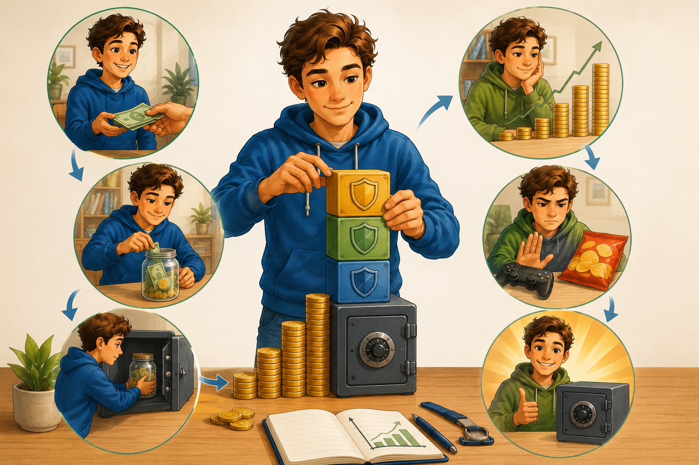

# Как собрать подушку безопасности и не потратить её случайно

Создать финансовую подушку безопасности редко получается за один день. Обычно она собирается постепенно: понемногу, но регулярно. Самое важное здесь даже не размер первых взносов, а привычка откладывать.

---

## Почему регулярность важнее рывка

Иногда человеку кажется, что нужно дождаться особого момента: большой суммы, хорошего месяца или идеального настроения. Но подушка безопасности редко появляется именно так. Намного чаще она собирается спокойно и постепенно.

Если откладывать понемногу, но постоянно, формируется привычка. А привычка в финансовых делах часто важнее вдохновения.

Если ты ещё не до конца понял, зачем нужен резерв и чем он отличается от обычных накоплений, сначала загляни в статью [Что такое финансовая подушка безопасности](what_is_emergency_fund.md).

## С чего начать

Первый шаг — понять, что резерв не возникает сам собой. Если тратить всё, что приходит, подушка не появится. Поэтому полезно сразу решить, какую часть денег ты будешь откладывать.

Даже небольшие суммы работают:

* 5% от карманных денег;
* 10% от подарков;
* часть дохода от подработки;
* остаток после обязательных расходов.

Даже если сначала сумма кажется маленькой, это нормально. Важнее доказать себе, что ты вообще умеешь создавать запас.

## Пошаговый план

### 1. Определи цель

Выбери сумму, которую хочешь собрать. Лучше не говорить себе просто «буду копить». Намного удобнее поставить понятную цель: например, резерв на 7000 рублей.

### 2. Храни резерв отдельно

Если деньги лежат вместе с обычными тратами, они быстро становятся «незаметными» и их легче потратить.

### 3. Откладывай сразу после получения денег

Многим помогает правило **«сначала заплати себе»**. Это значит: сначала отложить часть в резерв, а уже потом думать об остальных тратах.

### 4. Пополняй регулярно

Подушка любит ритм. Лучше откладывать понемногу каждую неделю или каждый месяц, чем ждать идеального момента.

### 5. Восстанавливай резерв после использования

Если часть денег пришлось взять на реальную проблему, потом важно вернуть сумму обратно. Иначе подушка постепенно исчезнет.

## Что помогает не срываться

Финансовые привычки работают лучше, если они простые и понятные. Вот несколько идей:

* выбрать постоянный день, когда откладываешь деньги;
* записывать, сколько уже собрано;
* делить большую цель на маленькие этапы;
* радоваться прогрессу, даже если он пока скромный.

Когда человек видит движение вперёд, ему легче продолжать.

## Что мешает накопить резерв

Вот самые частые ошибки:

* откладывать только «если что-то останется»;
* путать резерв с деньгами на развлечения;
* начинать, а потом бросать после первой неудачи;
* тратить запас на скидки и импульсивные покупки.

Ещё одна частая ошибка — пытаться быть слишком строгим. Если человек ставит слишком тяжёлую цель сразу, он быстро устаёт. Гораздо лучше строить резерв так, чтобы система была посильной.

## Как защитить резерв от случайных трат

Есть несколько полезных приёмов:

* дать резерву отдельное название;
* хранить его отдельно от повседневных денег;
* записывать прогресс;
* заранее решить, в каких случаях эти деньги можно трогать.

Иногда помогает даже простая подпись. Например, если на конверте или в заметке написано "только на непредвиденные расходы", резерв психологически труднее потратить просто так.

### Простое правило

Перед тем как взять деньги из резерва, можно задать себе три вопроса:

1. Это неожиданная ситуация?
2. Это важная трата?
3. Без этих денег сейчас правда трудно обойтись?

Если ответ на все три вопроса «да», резерв, скорее всего, используется по назначению.

## Что делать, если уже пришлось взять деньги из подушки

Это не провал. Для этого резерв и существует. Главное — после использования не забыть о втором шаге: начать восстанавливать сумму.

Здесь полезно действовать спокойно:

1. понять, сколько именно ушло;
2. определить, какую часть можно вернуть уже в ближайшее время;
3. снова включить регулярные пополнения.

Подушка безопасности не обязана быть идеальной всегда. Важно, чтобы она жила и обновлялась.

Чтобы система работала лучше, полезно заранее знать, [сколько денег должно быть в резерве и где их хранить](how_much_and_where.md).

## Почему маленькие шаги работают лучше

Люди часто думают, что начинать нужно только с большой суммы. Но финансовые привычки растут так же, как спортивные или учебные: через повторение. Даже маленький, но постоянный взнос помогает мозгу привыкнуть к мысли, что часть денег идёт не на удовольствие прямо сейчас, а на защиту будущего.

Со временем это меняет взгляд на деньги. Человек начинает думать не только о сегодняшнем дне, но и о завтрашней устойчивости. А это и есть один из главных признаков финансовой грамотности.

## Вывод

Финансовая подушка безопасности строится не за счёт одной большой удачи, а за счёт регулярности. Если откладывать понемногу, хранить деньги отдельно и не путать резерв с деньгами на желания, со временем появляется настоящий запас, который делает жизнь спокойнее и устойчивее.

Похожие материалы:
- [Что такое финансовая подушка безопасности](what_is_emergency_fund.md)
- [Сколько денег должно быть в резерве и где их хранить](how_much_and_where.md)

---
Авторы: Кутугин Даниил\
Ресурсы: LLM - Codex
