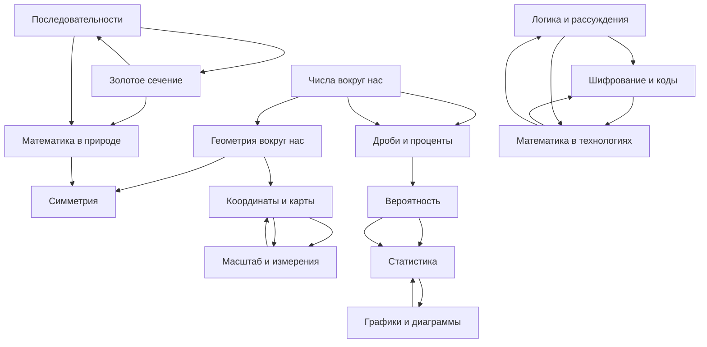

# KidBook: Математика в жизни

## Цель работы

В рамках лабораторной работы по курсу «Искусственный интеллект» создать раздел детской энциклопедии, посвящённый математике в повседневной жизни. Цель — показать десятилетним детям, что математика — не скучные уравнения, а живой инструмент познания мира. Использованы методы явного представления знаний (WikiData) и генеративные ИИ-модели (GigaChat, ChatGPT, DeepSeek).

## Участники команды OKAK_2

| # | ФИО | Статьи |
|---|-----|--------|
| 1 | Пинчук Михаил | Числа, Дроби, Координаты, Геометрия, Симметрия |
| 2 | Никольский Константин | Масштаб, Вероятность, Статистика, Графики, Последовательности |
| 3 | Смирнов Андрей | Логика, Шифрование, Математика в природе, Золотое сечение, Математика в технологиях |

## Концептуализация предметной области

Предметная область «Математика в жизни» охватывает пять взаимосвязанных тематических блоков:

1. **Числа и формы** — базовые математические объекты в реальном мире
2. **Пространство и измерения** — геометрия, координаты, масштаб
3. **Случайность и данные** — вероятность, статистика, графики
4. **Закономерности** — последовательности, природа, золотое сечение
5. **Математика в технологиях** — логика, шифрование, компьютеры

## Онтология раздела



## Таблица понятий и WikiData

| # | Понятие | WikiData ID | Автор |
|---|---------|-------------|-------|
| 1 | Числа вокруг нас | Q11563 | Пинчук М. |
| 2 | Дроби и проценты | Q66055 | Пинчук М. |
| 3 | Координаты и карты | Q43649 | Пинчук М. |
| 4 | Геометрия вокруг нас | Q8087 | Пинчук М. |
| 5 | Симметрия | Q41538 | Пинчук М. |
| 6 | Масштаб и измерения | Q194356 | Никольский К. |
| 7 | Вероятность | Q9492 | Никольский К. |
| 8 | Статистика | Q12483 | Никольский К. |
| 9 | Графики и диаграммы | Q742794 | Никольский К. |
| 10 | Последовательности | Q133900 | Никольский К. |
| 11 | Логика и рассуждения | Q1166618 | Смирнов А. |
| 12 | Шифрование и коды | Q8087 | Смирнов А. |
| 13 | Математика в природе | Q40026 | Смирнов А. |
| 14 | Золотое сечение | Q41690 | Смирнов А. |
| 15 | Математика в технологиях | Q48537 | Смирнов А. |

## SPARQL-запрос

Для получения понятий, связанных с математикой, в Wikidata использовался следующий запрос:

```sparql
SELECT DISTINCT ?item ?itemLabel ?instanceOf ?instanceOfLabel
WHERE {
  VALUES ?mathRoot { wd:Q395 wd:Q8087 wd:Q9492 wd:Q12483 }
  ?item wdt:P279* ?mathRoot .
  ?item wdt:P31 ?instanceOf .
  SERVICE wikibase:label {
    bd:serviceParam wikibase:language "ru,en" .
  }
}
LIMIT 50
```

Дополнительно использовался запрос для нахождения математических констант:

```sparql
SELECT ?item ?itemLabel ?value WHERE {
  ?item wdt:P31 wd:Q190453 .  # математическая константа
  OPTIONAL { ?item wdt:P1181 ?value . }
  SERVICE wikibase:label { bd:serviceParam wikibase:language "ru,en" . }
}
```

## Генерация статей

Все 15 статей созданы с помощью генеративных ИИ-моделей по следующему шаблону промпта:

```
Объясни для десятилетнего ребёнка понятие «{тема}» из математики.
Покажи, как это понятие встречается в повседневной жизни.
Статья на языке Markdown, структура:
- Вступление с конкретным жизненным примером
- Определение (простыми словами)
- Подробное описание с примерами и таблицей/схемой
- Интересные факты
- Краткое резюме
- Раздел «См. также» с 3 ссылками на другие статьи раздела
Текст должен быть живым, без скучных формальностей. Используй mermaid-диаграммы.
```

Каждая статья проверена на корректность содержания.

## Перекрёстные ссылки

Перекрёстные ссылки расставлены с помощью скрипта `cross_link.py` из корня репозитория. Скрипт читает `concepts.json` и заменяет вхождения лемм на ссылки в текстах всех статей WEB-раздела. Дополнительно каждая статья содержит раздел «См. также» с ручными ссылками на тематически близкие статьи.

## Структура раздела в WEB

```
WEB/1.2_natural_sciences/math_in_life/
├── articles/
│   ├── 01_numbers.md              — Числа вокруг нас
│   ├── 02_fractions.md            — Дроби и проценты
│   ├── 03_coordinates.md          — Координаты и карты
│   ├── 04_geometry.md             — Геометрия вокруг нас
│   ├── 05_symmetry.md             — Симметрия
│   ├── 06_scale.md                — Масштаб и измерения
│   ├── 07_probability.md          — Вероятность
│   ├── 08_statistics.md           — Статистика
│   ├── 09_graphs_charts.md        — Графики и диаграммы
│   ├── 10_sequences.md            — Последовательности и закономерности
│   ├── 11_logic.md                — Логика и рассуждения
│   ├── 12_encryption.md           — Шифрование и коды
│   ├── 13_math_in_nature.md       — Математика в природе
│   ├── 14_golden_ratio.md         — Золотое сечение
│   └── 15_math_in_tech.md         — Математика в технологиях
└── images/
    └── (15 изображений к статьям)
```

## Вывод

В результате работы создан полноценный раздел энциклопедии «KidBook» по теме «Математика в жизни». Раздел содержит 15 взаимосвязанных статей, написанных доступным для школьников языком. Концептуализация включает иерархические связи внутри тематических блоков и горизонтальные связи между блоками. Онтология построена на 15 понятиях из пяти предметных областей: числа и формы, пространство, данные, закономерности, технологии. Использование WikiData обеспечивает связь с международными базами знаний, а SPARQL-запросы позволяют расширить список концептов. Перекрёстные ссылки созданы автоматически и вручную.

---
*Авторы: команда OKAK_2 — Пинчук М., Никольский К., Смирнов А.*
*Ресурсы: WikiData, GigaChat, ChatGPT, DeepSeek*
