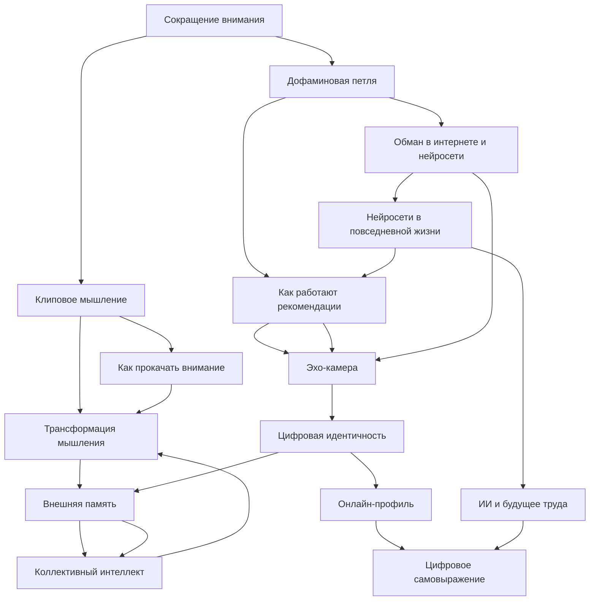

# KidBook: Человек в эпоху алгоритмов

## Цель работы

В рамках лабораторной работы по курсу «Искусственный интеллект» создать раздел детской энциклопедии, посвящённый влиянию цифровых технологий и алгоритмов на жизнь, мышление и личность человека. Использованы методы явного представления знаний (WikiData) и генеративные ИИ-модели (GigaChat, ChatGPT, DeepSeek).

## Участники команды OKAK_1

| # | ФИО | Статьи |
|---|-----|--------|
| 1 | Михайловская Мария | Сокращение внимания, Клиповое мышление, Как прокачать внимание, Дофаминовая петля |
| 2 | Жгенти Дарья | Как работают рекомендации, Эхо-камера, Цифровая идентичность, Онлайн-профиль |
| 3 | Ганяк Александр | Цифровое самовыражение, Внешняя память, Коллективный интеллект, Трансформация мышления |
| 4 | Кириллова Елена | Обман в интернете, Нейросети в жизни, ИИ и будущее труда |

## Концептуализация предметной области

Предметная область «Человек в эпоху алгоритмов» охватывает пять взаимосвязанных тематических блоков:

1. **Внимание и мышление** — как цифровая среда влияет на когнитивные способности
2. **Механизмы алгоритмов** — как работают рекомендательные системы и дофаминовые петли
3. **Цифровая идентичность** — кто мы есть в интернете
4. **Интернет как внешняя память** — коллективный интеллект и трансформация мышления
5. **Искусственный интеллект рядом** — нейросети в жизни, обман, будущее труда

## Онтология раздела



## Граф связей с WikiData

Для построения концептуализации использовались следующие сущности WikiData:

| Понятие | WikiData ID | Ссылка |
|---------|-------------|--------|
| Сокращение внимания | Q1064958 | https://www.wikidata.org/wiki/Q1064958 |
| Клиповое мышление | Q860326 | https://www.wikidata.org/wiki/Q860326 |
| Как прокачать внимание | Q211198 | https://www.wikidata.org/wiki/Q211198 |
| Дофаминовая петля | Q170304 | https://www.wikidata.org/wiki/Q170304 |
| Рекомендательные системы | Q554950 | https://www.wikidata.org/wiki/Q554950 |
| Эхо-камера | Q3334446 | https://www.wikidata.org/wiki/Q3334446 |
| Цифровая идентичность | Q4167836 | https://www.wikidata.org/wiki/Q4167836 |
| Онлайн-профиль | Q847263 | https://www.wikidata.org/wiki/Q847263 |
| Цифровое самовыражение | Q1778022 | https://www.wikidata.org/wiki/Q1778022 |
| Внешняя память | Q48319 | https://www.wikidata.org/wiki/Q48319 |
| Коллективный интеллект | Q1123413 | https://www.wikidata.org/wiki/Q1123413 |
| Трансформация мышления | Q48540 | https://www.wikidata.org/wiki/Q48540 |
| Обман в интернете (ИИ) | Q11660 | https://www.wikidata.org/wiki/Q11660 |
| Нейросети в жизни | Q2539 | https://www.wikidata.org/wiki/Q2539 |
| ИИ и будущее труда | Q11661 | https://www.wikidata.org/wiki/Q11661 |

## SPARQL-запрос

Для получения связанных понятий использовался SPARQL-запрос в [Wikidata Query Service](https://query.wikidata.org/). Пример запроса для получения понятий, связанных с искусственным интеллектом и когнитивными науками:

```sparql
SELECT DISTINCT ?item ?itemLabel ?related ?relatedLabel
WHERE {
  VALUES ?root { wd:Q11660 wd:Q2539 wd:Q170304 wd:Q3334446 }
  ?item wdt:P279* ?root .
  OPTIONAL { ?item wdt:P361 ?related . }
  OPTIONAL { ?item wdt:P527 ?related . }
  SERVICE wikibase:label {
    bd:serviceParam wikibase:language "ru,en" .
  }
}
LIMIT 100
```

## Генерация статей

Все 15 статей написаны с помощью генеративных ИИ-моделей (GigaChat, ChatGPT, DeepSeek) по промпту вида:

```
Объясни для десятилетнего ребёнка понятие «{тема}» в контексте цифрового мира и алгоритмов.
Статья должна быть написана на языке Markdown.
Обязательные разделы:
- Определение (простыми словами)
- Подробное описание с примерами из жизни
- Почему это важно знать
- Интересные факты
- См. также
Используй конкретные примеры и аналогии. Не используй сложную терминологию без объяснения.
```

Каждая статья дополнена изображением и проверена на корректность содержания.

## Перекрёстные ссылки

Перекрёстные ссылки расставлены с помощью скрипта `cross_link.py` из корня репозитория. Скрипт анализирует все файлы `concepts.json` в директории `WORK` и заменяет вхождения лемм в текстах статей на ссылки. Существующие ссылки и блоки кода не затрагиваются.

Список лемм для каждой статьи подобран с учётом падежей и часто встречающихся форм слов.

## Структура раздела в WEB

```
WEB/5.1_technology_and_digital_literacy/man_in_the_age_of_algorithms/
├── articles/
│   ├── 1-Сокращение_внимания_почему_мозг_устает.md
│   ├── 1-Клиповое_мышление_когда_мир_выглядит_как_лента.md
│   ├── 1-Как_прокачать_внимание_и_приручить_клипы.md
│   ├── 2-Дофаминовая петля.md
│   ├── 2-Как работают рекомендации.md
│   ├── 2-Ловушка.md
│   ├── 3-Цифровая идентичность.md
│   ├── 3-Создание и управление онлайн-профилем.md
│   ├── 3-Цифровое самовыражение и творчество.md
│   ├── 4-internet_memory.md
│   ├── 4-internet_collective_intelligence.md
│   ├── 4-internet_thinking_transformation.md
│   ├── 5-ai_internet_deception_article.md
│   ├── 5-ai_daily_life.md
│   └── 5-ai_replace_humans_work.md
└── images/
    └── (15 изображений к статьям)
```

## Вывод

В результате работы создан полноценный раздел энциклопедии «KidBook» по теме «Человек в эпоху алгоритмов». Раздел содержит 15 связанных статей, охватывающих темы: внимание и клиповое мышление, алгоритмические рекомендации и дофаминовые петли, цифровая идентичность, коллективный интеллект, нейросети и будущее труда. Статьи написаны доступным для школьников языком, снабжены изображениями и перекрёстными ссылками. Онтология включает как иерархические, так и горизонтальные связи между понятиями. Данные WikiData подтверждают научную обоснованность выбранных концептов.

---
*Авторы: команда OKAK_1 — Михайловская М., Жгенти Д., Ганяк А., Кириллова Е.*
*Ресурсы: WikiData, GigaChat, ChatGPT, DeepSeek*
