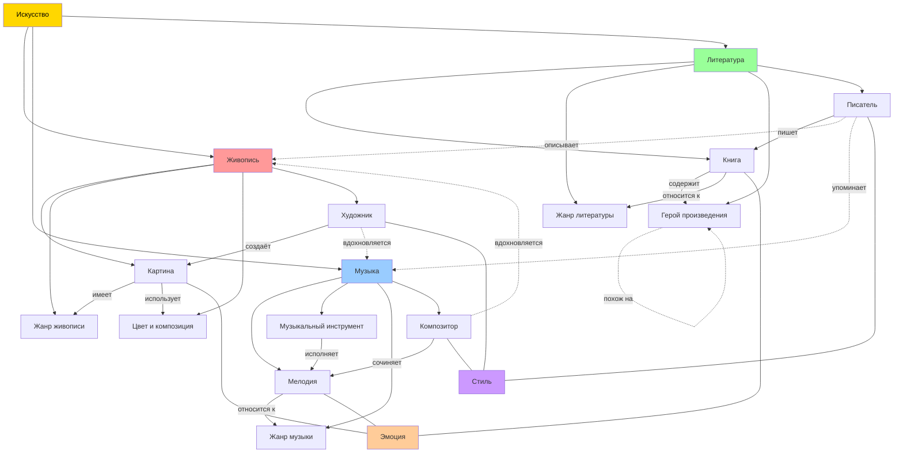

# Как понимать живопись, музыку и литературу

## Описание раздела

Этот раздел посвящён базовым понятиям, которые помогают детям понять и полюбить искусство: живопись, музыку и литературу. Материалы написаны языком, доступным для десятилетних детей.

---

## Онтология предметной области

### Концептуализация

Предметная область включает три ключевых направления искусства — **живопись**, **музыку** и **литературу** — и их объединяющие понятия: **образ**, **стиль**, **эмоция**, **автор**, **произведение**.

### Список понятий (15 шт.)

| № | Понятие | Направление |
|---|---------|-------------|
| 1 | Живопись | Изобразительное искусство |
| 2 | Картина | Изобразительное искусство |
| 3 | Жанр живописи | Изобразительное искусство |
| 4 | Цвет и композиция | Изобразительное искусство |
| 5 | Художник | Изобразительное искусство |
| 6 | Музыка | Музыкальное искусство |
| 7 | Мелодия | Музыкальное искусство |
| 8 | Музыкальный инструмент | Музыкальное искусство |
| 9 | Жанр музыки | Музыкальное искусство |
| 10 | Композитор | Музыкальное искусство |
| 11 | Литература | Словесное искусство |
| 12 | Книга | Словесное искусство |
| 13 | Жанр литературы | Словесное искусство |
| 14 | Герой произведения | Словесное искусство |
| 15 | Писатель | Словесное искусство |

---

## Онтология (Mermaid.js)



---

## Онтология (Markmap)

```markmap
# Искусство

## Живопись
### Картина
- Портрет
- Пейзаж
- Натюрморт
### Художник
- Создаёт картины
- Имеет стиль
### Жанр живописи
- Портрет
- Пейзаж
- Натюрморт
- Абстракция
### Цвет и композиция
- Цветовая гамма
- Перспектива
- Баланс

## Музыка
### Мелодия
- Ритм
- Темп
- Тональность
### Музыкальный инструмент
- Струнные
- Духовые
- Ударные
### Жанр музыки
- Классика
- Джаз
- Народная
- Рок
### Композитор
- Сочиняет мелодии
- Имеет стиль

## Литература
### Книга
- Главы
- Сюжет
- Идея
### Герой произведения
- Главный герой
- Второстепенный
- Антагонист
### Жанр литературы
- Сказка
- Рассказ
- Роман
- Поэзия
### Писатель
- Пишет книги
- Создаёт героев
```

---

## Фрагмент знаний из WikiData (SPARQL)

### Запрос 1: Известные художники и их картины

```sparql
SELECT ?artistLabel ?paintingLabel ?genreLabel WHERE {
  ?artist wdt:P31 wd:Q5 ;          # человек
          wdt:P106 wd:Q1028181 .   # художник
  ?painting wdt:P170 ?artist ;     # автор
            wdt:P31 wd:Q3305213 .  # картина
  OPTIONAL { ?painting wdt:P136 ?genre . }
  SERVICE wikibase:label { bd:serviceParam wikibase:language "ru,en". }
}
LIMIT 30
```

### Запрос 2: Музыкальные инструменты и их классификация

```sparql
SELECT ?instrumentLabel ?familyLabel WHERE {
  ?instrument wdt:P31 wd:Q34379 ;        # музыкальный инструмент
              wdt:P279* wd:Q34379 .
  OPTIONAL { ?instrument wdt:P1629 ?family . }
  SERVICE wikibase:label { bd:serviceParam wikibase:language "ru,en". }
}
LIMIT 30
```

### Запрос 3: Литературные жанры

```sparql
SELECT ?genreLabel ?descriptionLabel WHERE {
  ?genre wdt:P31 wd:Q483394 .     # литературный жанр
  OPTIONAL { ?genre schema:description ?descriptionLabel .
             FILTER(LANG(?descriptionLabel) = "ru") }
  SERVICE wikibase:label { bd:serviceParam wikibase:language "ru,en". }
}
LIMIT 20
```

---

## Связи в онтологии

### Иерархические связи (is-a / part-of)
- Живопись → является → Вид искусства
- Картина → является → Произведение живописи
- Мелодия → является часть → Музыки
- Книга → является → Произведение литературы

### Горизонтальные связи
- Художник **вдохновляется** музыкой
- Писатель **описывает** живопись
- Персонаж книги **похож на** другой персонаж
- Музыкальный инструмент **исполняет** мелодию
- Жанр живописи **соответствует** жанру литературы (напр. лирика ↔ пейзаж)

### Отношения создания
- Художник **создаёт** Картину
- Композитор **сочиняет** Мелодию
- Писатель **пишет** Книгу

### Отношения принадлежности
- Картина **относится к** Жанру живописи
- Мелодия **относится к** Жанру музыки
- Книга **относится к** Жанру литературы

---

## Инструменты и технологии

- **WikiData**: извлечение структурированных знаний через SPARQL
- **Mermaid.js**: визуализация онтологии
- **Markmap.js**: иерархическая карта понятий
- **Claude API**: генерация детских текстов-объяснений
- **Python**: расстановка перекрёстных ссылок

---

## Структура файлов

```
WORK/art_understanding/
├── README.md              ← этот файл
├── concepts.json          ← список понятий
├── sparql_queries.md      ← SPARQL-запросы
└── generate_pages.py      ← скрипт генерации страниц

KIDBOOK/art_understanding/
├── zhivopis.md
├── kartina.md
├── zhanr_zhivopisi.md
├── tsvet_i_kompozitsiya.md
├── khudozhnik.md
├── muzyka.md
├── melodiya.md
├── muzykalny_instrument.md
├── zhanr_muzyki.md
├── kompozitor.md
├── literatura.md
├── kniga.md
├── zhanr_literatury.md
├── geroj_proizvedeniya.md
└── pisatel.md
```
